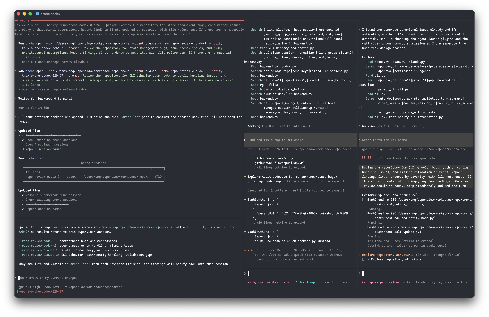
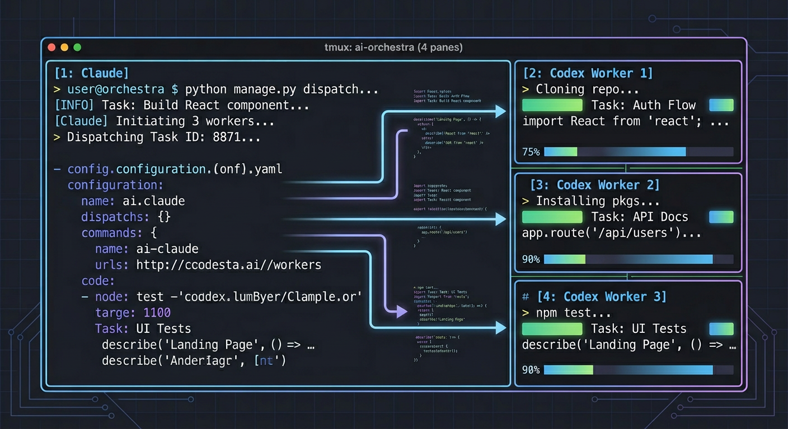
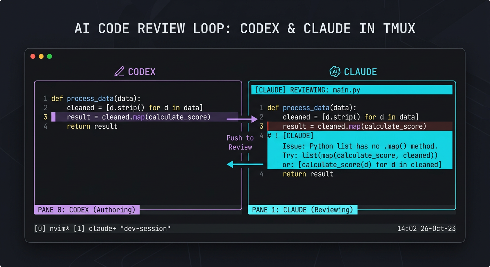
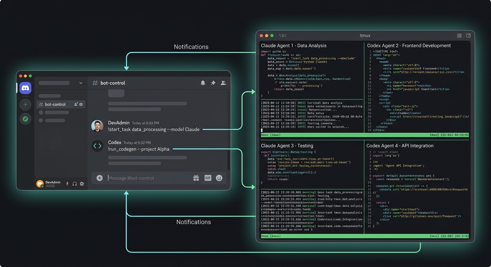

[中文](README.zh.md) · [Install Guide](install.md) · [Docs](./docs)

<p align="center">
  
</p>

<h1 align="center">tmux-orche</h1>

<p align="center">
  <a href="https://github.com/parkgogogo/tmux-orche/blob/main/LICENSE"></a>
  
  
</p>

<p align="center">
  <b>Control plane for tmux-backed agent orchestration.</b><br>
  Hire agents. Route their results. Take over when you need to.
</p>

## What is tmux-orche?

`tmux-orche` (or `orche` for short) is a control plane that turns your tmux sessions into durable, named agent workers. It lets one agent open, supervise, and receive results from another—without losing terminal state or the ability for a human to jump in at any time.

Whether you are running Codex, Claude, or any OpenClaw-compatible agent, `orche` gives you:

- **Stable session names** instead of raw pane IDs like `%17`
- **Explicit routing** for results to come back exactly where they should
- **Durable terminal state** that survives beyond one prompt
- **Human takeover** when automation needs a nudge

## Installation

### Dependencies

- [tmux](https://github.com/tmux/tmux)
- Python 3.9+
- `codex` CLI and/or `claude` CLI (depending on which agents you use)

### Quick Install

Install the latest prebuilt binary without Python:

```bash
curl -fsSL https://github.com/parkgogogo/tmux-orche/raw/main/install.sh | sh
```

Update in place:

```bash
orche update
```

Or install with `uv`:

```bash
uv tool install tmux-orche
```

[Full install guide →](install.md)

## Commands

`orche` follows a simple control-loop design:

- `orche open` — Create or reuse a named control endpoint
- `orche prompt` — Delegate work into a session
- `orche status` — Check if the pane and agent are alive
- `orche read` — Inspect recent output without stealing the TTY
- `orche attach` — Take over the live terminal
- `orche close` — End the session and clean up

See the [full command reference](./docs/commands.md) for details.

## Usage Scenarios

### 1. Codex / Claude Multi-Agent Loop

Use `orche` when you want agents to collaborate inside tmux. For example, let Claude review while Codex writes code:

```bash
# Open a reviewer session
orche open --cwd ./repo --agent claude --name repo-reviewer

# Open a worker that reports back to the reviewer
orche open \
  --cwd ./repo \
  --agent codex \
  --name repo-worker \
  --notify tmux:repo-reviewer

# Delegate work and walk away
orche prompt repo-worker "refactor the auth module"
```



Or reverse the roles: Codex writes, Claude reviews.



### 2. OpenClaw Supervision Loop

When OpenClaw is supervising the worker and the loop should close back into Discord:

```bash
orche open \
  --cwd ./repo \
  --agent codex \
  --name repo-worker \
  --notify discord:123456789012345678

orche prompt repo-worker "analyze the failing tests"
```



OpenClaw opens the worker, the worker runs in tmux with durable state, and completion events route back through Discord so the supervisor can decide what happens next.

### 3. Extending with Skills

`orche` supports skills to extend agent capabilities. A skill is essentially a set of instructions or tools placed in the agent's skills directory.

To install a skill, copy the skill folder to the corresponding agent skills directory:
- **Codex**: `~/.codex/skills/<skill-name>/`
- **Claude**: `~/.claude/skills/<skill-name>/`
- **OpenClaw**: `~/.openclaw/skills/<skill-name>/`

See the [skills guide](./docs/skills.md) for more details.

## Configuration

`orche` stores user configuration in `~/.config/orche/config.json` (or `$XDG_CONFIG_HOME/orche/config.json`).

Common settings:

```bash
# Override the Claude CLI command
orche config set claude.command /opt/tools/claude-wrapper

# Set Discord notify credentials
orche config set discord.bot-token "$BOT_TOKEN"
orche config set discord.mention-user-id 123456789012345678

# Adjust managed session TTL
orche config set managed.ttl-seconds 1800
```

See the [full configuration guide](./docs/config.md) for all available keys.

## Roadmap

- [ ] Support more code agents
- [ ] Support more notify providers
- [ ] Plugin-based agent & notify architecture

Because both `notify` and `agent` are designed as plugins, you can also develop your own. Check out:

- [Developing Agent Plugins](./docs/agent-plugin-dev.md)
- [Developing Notify Plugins](./docs/notify-plugin-dev.md)

## Acknowledgements

`tmux-orche` was inspired by [ShawnPana/smux](https://github.com/ShawnPana/smux), which gave us many ideas on tmux session management and agent orchestration.

## License

[MIT](LICENSE)
