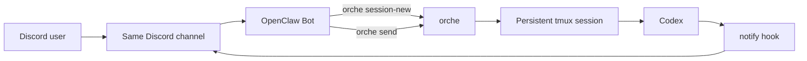

[中文](README.zh.md) · [Install Guide](https://github.com/parkgogogo/tmux-orche/raw/main/install.md)

# tmux-orche

tmux-backed Codex orchestration for OpenClaw, Discord, and other fire-and-forget agent workflows.

`tmux-orche` lets an agent hand work to Codex, return immediately, and come back through the same persistent tmux session later. The result is simple: OpenClaw stops burning tokens while Codex keeps working in the background.

## Why tmux-orche

- Run Codex in a persistent tmux session instead of tying work to one blocking process.
- Use `orche send` as a fire-and-forget handoff boundary.
- Route completion notifications back to the same Discord channel.
- Keep one durable Codex session per repo, task, or workstream.
- Auto-manage per-session `CODEX_HOME` so concurrent Codex runs can keep separate notify wiring.

## Quick Start

Create or reuse a session:

```bash
orche session-new \
  --cwd /path/to/repo \
  --agent codex \
  --name repo-codex-main \
  --discord-channel-id 123456789012345678
```

Send work and return immediately:

```bash
orche send --session repo-codex-main "analyze the failing tests and propose a fix"
```

Inspect the live session later:

```bash
orche status --session repo-codex-main
orche read --session repo-codex-main --lines 120
orche history --session repo-codex-main --limit 20
```

## Installation

Full step-by-step install guide: <https://github.com/parkgogogo/tmux-orche/raw/main/install.md>

Install from PyPI:

```bash
pip install tmux-orche
```

Install with `uv`:

```bash
uv tool install tmux-orche
```

Install from source:

```bash
git clone https://github.com/parkgogogo/orche
cd orche
python3 -m venv .venv
source .venv/bin/activate
pip install -U pip
pip install .
```

## Feature Highlights

- Fire-and-forget orchestration: `orche send` submits work and returns immediately.
- Persistent control: inspect, steer, cancel, and close the same Codex tmux session later.
- Discord notify workflow: send completion updates back to the originating channel.
- XDG-native storage: config in `~/.config/orche/config.json`, state in `~/.local/share/orche/`.
- Automatic `CODEX_HOME` isolation: each session can get its own temporary Codex home under `/tmp/orche-codex-<session>/`.

## Primary Use Case

`tmux-orche` is built around one production pattern:

1. A user sends a task in Discord and mentions `@OpenClaw`.
2. OpenClaw calls `orche session-new`.
3. OpenClaw calls `orche send`.
4. `orche` returns immediately, so OpenClaw ends the turn and stops spending tokens.
5. Codex keeps running inside a persistent tmux session.
6. A notify hook posts completion back into the same Discord channel.
7. The user continues the conversation only when there is something useful to see.

## Prerequisites

Runtime dependencies:

- `tmux`
- `tmux-bridge`
- `codex` CLI
- Python `3.9+`

Discord environment:

- One Discord Guild
- One channel such as `#coding`, used for both user requests and Codex completion notifications
- One OpenClaw bot that reads user messages and calls `orche`
- One Codex notify bot that posts completion notifications back to that same channel

OpenClaw typically reads its Discord settings from `~/.openclaw/openclaw.json`.

## Architecture



## Command Reference

Create or reuse a Codex session:

```bash
orche session-new --cwd /repo --agent codex --name repo-codex-main --discord-channel-id 123456789012345678
```

Send a task into an existing session:

```bash
orche send --session repo-codex-main "review the recent auth changes"
```

Check status:

```bash
orche status --session repo-codex-main
```

Read terminal output:

```bash
orche read --session repo-codex-main --lines 80
```

Read local control history:

```bash
orche history --session repo-codex-main --limit 20
```

Send follow-up text without pressing Enter:

```bash
orche type --session repo-codex-main --text "focus on the migration failure"
```

Send keys:

```bash
orche keys --session repo-codex-main --key Enter
orche keys --session repo-codex-main --key Escape --key Enter
```

Cancel the current turn:

```bash
orche cancel --session repo-codex-main
```

Close the session:

```bash
orche close --session repo-codex-main
```

Show the latest turn summary:

```bash
orche turn-summary --session repo-codex-main
```

Manage runtime config:

```bash
orche config list
orche config get discord.channel-id
orche config set discord.channel-id 123456789012345678
orche config set discord.bot-token "$BOT_TOKEN"
orche config set discord.mention-user-id 123456789012345678
orche config set notify.enabled true
```

## Notify Workflow

Bind the Discord destination when creating the session:

```bash
orche session-new \
  --cwd /repo \
  --agent codex \
  --name repo-codex-main \
  --discord-channel-id 123456789012345678
```

`tmux-orche` will then:

1. Create or reuse the tmux session.
2. Prepare a per-session `CODEX_HOME`.
3. Copy your baseline `~/.codex/` contents into that temporary home.
4. Wire the notify hook for the current session and Discord channel.
5. Clean up the managed temporary home on `orche close`.

To debug notify delivery directly:

```bash
echo '{"event":"turn-complete","summary":"test"}' \
  | orche _notify-discord --channel-id 123456789012345678 --session repo-codex-main --verbose
```

## Configuration And Paths

Config file:

```text
~/.config/orche/config.json
```

State directory:

```text
~/.local/share/orche/
```

Useful config keys:

- `discord.bot-token`
- `discord.channel-id`
- `discord.mention-user-id`
- `discord.webhook-url`
- `notify.enabled`

## Contributing

Issues and pull requests are welcome. If you are changing CLI behavior, update tests and both README files in the same change so the docs stay aligned with the command surface.

## License

[MIT](LICENSE)
