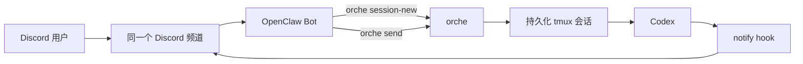

[English](README.md) · [Install Guide](https://github.com/parkgogogo/tmux-orche/raw/main/install.md)

# tmux-orche

面向 OpenClaw、Discord 与其他 fire-and-forget agent 工作流的 tmux 后端 Codex 编排工具。

`tmux-orche` 的核心作用，是让 agent 把任务交给 Codex 后立刻返回，稍后再通过同一个持久化 tmux 会话继续接管。结果很直接：OpenClaw 不再为了等待 Codex 完成而持续消耗 token，Codex 则继续在后台工作。

## 为什么用 tmux-orche

- 让 Codex 跑在持久化 tmux 会话里，而不是绑死在一次阻塞式进程上。
- 用 `orche send` 作为 fire-and-forget 的明确交接点。
- 把完成通知发回同一个 Discord 频道。
- 为每个仓库、任务或工作流保留一个可复用的 Codex 会话。
- 自动管理按 session 隔离的 `CODEX_HOME`，便于并发运行多个带独立 notify 配置的 Codex。

## 快速开始

创建或复用会话：

```bash
orche session-new \
  --cwd /path/to/repo \
  --agent codex \
  --name repo-codex-main \
  --discord-channel-id 123456789012345678
```

发送任务并立即返回：

```bash
orche send --session repo-codex-main "analyze the failing tests and propose a fix"
```

稍后再检查同一个会话：

```bash
orche status --session repo-codex-main
orche read --session repo-codex-main --lines 120
orche history --session repo-codex-main --limit 20
```

## 安装

完整分步安装说明：<https://github.com/parkgogogo/tmux-orche/raw/main/install.md>

从 PyPI 安装：

```bash
pip install tmux-orche
```

使用 `uv` 安装：

```bash
uv tool install tmux-orche
```

从源码安装：

```bash
git clone https://github.com/parkgogogo/orche
cd orche
python3 -m venv .venv
source .venv/bin/activate
pip install -U pip
pip install .
```

## 功能亮点

- Fire-and-forget 编排：`orche send` 提交任务后立即返回。
- 持久化控制：稍后仍可继续查看、引导、取消或关闭同一个 Codex tmux 会话。
- Discord 通知链路：把完成消息发回原始频道。
- 原生 XDG 路径：配置放在 `~/.config/orche/config.json`，状态放在 `~/.local/share/orche/`。
- 自动 `CODEX_HOME` 隔离：每个 session 都可获得自己的临时 Codex home，路径为 `/tmp/orche-codex-<session>/`。

## 核心使用场景

`tmux-orche` 主要围绕这样一条生产链路设计：

1. 用户在 Discord 中发送任务并 `@OpenClaw`。
2. OpenClaw 调用 `orche session-new`。
3. OpenClaw 调用 `orche send`。
4. `orche` 立即返回，因此 OpenClaw 当前回合结束，不再继续消耗 token。
5. Codex 在持久化 tmux 会话中继续运行。
6. notify hook 将完成消息发回同一个 Discord 频道。
7. 用户只在真正有结果时才继续交互。

## 前置条件

运行依赖：

- `tmux`
- `tmux-bridge`
- `codex` CLI
- Python `3.9+`

Discord 环境：

- 一个 Discord Guild
- 一个频道，例如 `#coding`，同时用于接收用户任务和回传 Codex 完成通知
- 一个 OpenClaw bot，用于读取用户消息并调用 `orche`
- 一个 Codex notify bot，用于把完成通知发回同一个频道

OpenClaw 通常从 `~/.openclaw/openclaw.json` 读取 Discord 配置。

## 架构



## 命令参考

创建或复用 Codex 会话：

```bash
orche session-new --cwd /repo --agent codex --name repo-codex-main --discord-channel-id 123456789012345678
```

向已有会话发送任务：

```bash
orche send --session repo-codex-main "review the recent auth changes"
```

查看状态：

```bash
orche status --session repo-codex-main
```

读取终端输出：

```bash
orche read --session repo-codex-main --lines 80
```

查看本地控制历史：

```bash
orche history --session repo-codex-main --limit 20
```

输入后续文本但不按 Enter：

```bash
orche type --session repo-codex-main --text "focus on the migration failure"
```

发送按键：

```bash
orche keys --session repo-codex-main --key Enter
orche keys --session repo-codex-main --key Escape --key Enter
```

取消当前回合：

```bash
orche cancel --session repo-codex-main
```

关闭会话：

```bash
orche close --session repo-codex-main
```

查看最近一次 turn summary：

```bash
orche turn-summary --session repo-codex-main
```

管理运行时配置：

```bash
orche config list
orche config get discord.channel-id
orche config set discord.channel-id 123456789012345678
orche config set discord.bot-token "$BOT_TOKEN"
orche config set discord.mention-user-id 123456789012345678
orche config set notify.enabled true
```

## Notify 工作流

创建会话时绑定 Discord 目标频道：

```bash
orche session-new \
  --cwd /repo \
  --agent codex \
  --name repo-codex-main \
  --discord-channel-id 123456789012345678
```

此后 `tmux-orche` 会：

1. 创建或复用 tmux 会话。
2. 为该 session 准备独立的 `CODEX_HOME`。
3. 把你的基础 `~/.codex/` 内容复制到这个临时目录。
4. 为当前 session 和 Discord 频道写入 notify hook 配置。
5. 在执行 `orche close` 时清理托管的临时目录。

如需直接调试 notify 投递：

```bash
echo '{"event":"turn-complete","summary":"test"}' \
  | orche _notify-discord --channel-id 123456789012345678 --session repo-codex-main --verbose
```

## 配置与路径

配置文件：

```text
~/.config/orche/config.json
```

状态目录：

```text
~/.local/share/orche/
```

常用配置键：

- `discord.bot-token`
- `discord.channel-id`
- `discord.mention-user-id`
- `discord.webhook-url`
- `notify.enabled`

## 参与贡献

欢迎提交 issue 和 pull request。如果你修改了 CLI 行为，请同时更新测试以及中英文 README，确保文档与命令面保持一致。

## License

[MIT](LICENSE)
